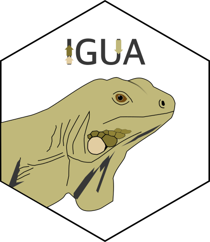

IGUA |Stars|
============

.. |Stars| image:: https://img.shields.io/github/stars/zellerlab/IGUA.svg?style=social&maxAge=3600&label=Star
   :target: https://github.com/zellerlab/IGUA/stargazers
   :class: dark-light

*Iterative Gene clUster Analysis, a fast and flexible gene cluster family delineation method.*

|Actions| |Coverage| |PyPI| |Bioconda| |AUR| |Wheel| |Versions| |Implementations| |License| |Source| |Mirror| |Issues| |Docs| |Changelog| |Downloads| |Preprint|

.. |Actions| image:: https://img.shields.io/github/actions/workflow/status/zellerlab/IGUA/test.yml?branch=main&logo=github&style=flat-square&maxAge=300
   :target: https://github.com/zellerlab/IGUA/actions

.. |Coverage| image:: https://img.shields.io/codecov/c/gh/zellerlab/IGUA?logo=codecov&style=flat-square&maxAge=600
   :target: https://codecov.io/gh/zellerlab/IGUA/

.. |PyPI| image:: https://img.shields.io/pypi/v/igua.svg?style=flat-square&maxAge=3600
   :target: https://pypi.python.org/pypi/igua

.. |Bioconda| image:: https://img.shields.io/conda/vn/bioconda/igua?ogo=anaconda&style=flat-square&maxAge=3600
   :target: https://anaconda.org/bioconda/igua

.. |AUR| image:: https://img.shields.io/aur/version/igua?logo=archlinux&style=flat-square&maxAge=3600
   :target: https://aur.archlinux.org/packages/igua

.. |Wheel| image:: https://img.shields.io/pypi/wheel/igua?style=flat-square&maxAge=3600
   :target: https://pypi.org/project/igua/#files

.. |Versions| image:: https://img.shields.io/pypi/pyversions/igua.svg?logo=python&style=flat-square&maxAge=3600
   :target: https://pypi.org/project/igua/#files

.. |Implementations| image:: https://img.shields.io/pypi/implementation/igua.svg?logo=python&style=flat-square&maxAge=3600&label=impl
   :target: https://pypi.org/project/igua/#files

.. |License| image:: https://img.shields.io/badge/license-GPL--3.0--or--later-blue.svg?style=flat-square&maxAge=2678400
   :target: https://choosealicense.com/licenses/gpl-3.0/

.. |Source| image:: https://img.shields.io/badge/source-GitHub-303030.svg?maxAge=2678400&style=flat-square
   :target: https://github.com/zellerlab/IGUA/

.. |Mirror| image:: https://img.shields.io/badge/mirror-EMBL-009f4d?style=flat-square&maxAge=2678400
   :target: https://git.embl.de/larralde/pyhmmer/

.. |Issues| image:: https://img.shields.io/github/issues/zellerlab/IGUA.svg?style=flat-square&maxAge=600
   :target: https://github.com/zellerlab/IGUA/issues

.. |Docs| image:: https://img.shields.io/readthedocs/pyhmmer?style=flat-square&maxAge=3600
   :target: http://pyhmmer.readthedocs.io/en/stable/?badge=stable

.. |Changelog| image:: https://img.shields.io/badge/keep%20a-changelog-8A0707.svg?maxAge=2678400&style=flat-square
   :target: https://github.com/zellerlab/IGUA/blob/master/CHANGELOG.md

.. |Downloads| image:: https://img.shields.io/badge/dynamic/regex?url=https%3A%2F%2Fpepy.tech%2Fprojects%2FIGUA&search=%5B0-9%5D%2B.%5B0-9%5D%2B(k%7CM)&style=flat-square&label=downloads&color=303f9f&cacheSeconds=86400
   :target: https://pepy.tech/project/IGUA

.. |Preprint| image:: https://img.shields.io/badge/preprint-bioRxiv-darkblue?style=flat-square&maxAge=2678400
   :target: https://www.biorxiv.org/content/10.1101/2025.05.15.654203v1

Overview
--------

IGUA is a method for high-throughput content-agnostic identification of
Gene Cluster Families (GCFs) from gene clusters of genomic and metagenomic 
origin. It performs three clustering iterations to perform GCF assignment:

.. grid:: 1 3 3 3
   :gutter: 1

   .. grid-item-card:: 1️⃣ Fragment mapping

      Reduce the input sequence space by identifying which gene clusters 
      are almost identical fragments from each other. *Useful in combining
      datasets of metagenomic origin, or in combining results from various
      genome mining tools which may report overlapping gene clusters*

   .. grid-item-card:: 2️⃣ Nucleotide deduplication

      Find similar gene clusters in genomic space, using linear clustering 
      with lower sequence identity and reciprocical coverage. *Effectively
      combine gene clusters with high conservation while taking into 
      account possible evolutionary events like gene deletion or fusion*.

   .. grid-item-card:: 3️⃣ Protein representation

      Compute a numerical representation of gene clusters in terms of 
      protein composition, using representatives from a protein sequence
      clustering, and perform hierarchical clustering. *Identify more 
      distant gene clusters which share the same proteins while not 
      necessarily maintaining the same gene architecture.*

Compared to similar methods such as `BiG-SLiCE <https://github.com/medema-group/bigslice>`_
or `BiG-SCAPE <https://github.com/medema-group/BiG-SCAPE>`_, IGUA does not use Pfam 
domains to represent gene cluster composition, using instead representatives
from a fast unsupervised clustering computed with MMseqs2. This allows IGUA to 
accurately account for proteins that may not be covered by Pfam, and avoids 
performing a costly annotation step with HMMER. The resulting protein 
representatives can be later annotated indepently to transfer annotations to 
the GCFs.

Setup
-----

Have a look at the :doc:`Installing <guide/installing>` page to find the different
ways to install IGUA. IGUA depends on some common scientific Python packages
(`scipy`, `anndata`, `pandas`) as well as a working MMseqs2 install.

Citation
--------

IGUA is scientific software, with a
`preprint <https://www.biorxiv.org/content/10.1101/2025.05.15.654203v1>`_
currently available on bioRxiv.

Library
-------

.. toctree::
   :maxdepth: 2

   User Guide <guide/index>
   API Reference <api/index>
   CLI Reference <cli>

License
-------

This library is provided under the `GNU General Public License 3.0 or later <https://choosealicense.com/licenses/gpl-3.0/>`_.
See the :doc:`Copyright Notice <guide/copyright>` section for more information
including the complete license text.

This project was co-developed by:

+--------------------------------------+--------------------------------------+
| .. image:: _images/lumc.png          | | **Martin Larralde**                |
|    :class: dark-light                | | PhD Candidate                      |
|    :height: 50px                     |                                      |
|                                      | | **Georg Zeller**                   |
|                                      | | Associate Professor                |
+--------------------------------------+--------------------------------------+
| .. image:: _images/umu.png           | | **Laura M. Carroll**               |
|    :class: dark-light                | | Assistant Professor                |
|    :height: 50px                     |                                      |
|                                      | | **Josefin Blom**                   |
|                                      | | PhD Student                        |
|                                      |                                      |
|                                      | | **Hadrien Gourlé**                 |
|                                      | | Postdoctoral Fellow                |
+--------------------------------------+--------------------------------------+
| .. image:: _images/epfl.svg          | | **Hale-Seda Radoykova**            |
|    :class: dark-light                | | Doctoral Assistant                 |
|    :height: 50px                     |                                      |
|                                      | | **Lucas Paoli**                    |
|                                      | | Associate Professor                |
+--------------------------------------+--------------------------------------+

